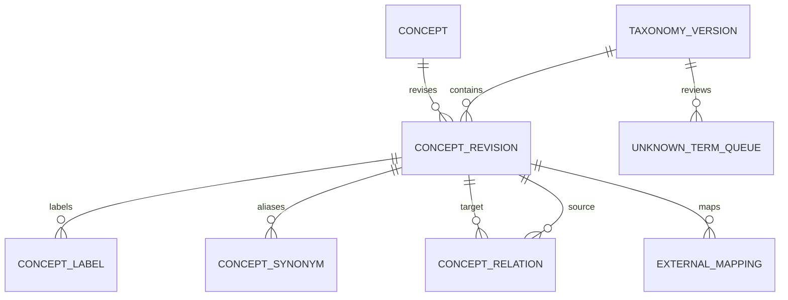

# 6단계. 매칭 분류체계·온톨로지 설계

> 문서 상태: 설계·초기 구현 완료 v1.0  
> 기준일: 2026-08-01  
> 상위 로드맵: [30단계 통합 설계 로드맵](./00-roadmap.md)  
> 선행 설계: [5단계 AI 매칭엔진 아키텍처](./05-ai-matching-engine-architecture.md)  
> DB 기준: [DB ERD·테이블 정의서](./db-erd-table-spec.md)  
> 구현 원본: [온톨로지 카탈로그](../src/meet_ai/ontology/catalog.v1.json), [PostgreSQL 마이그레이션](../db/migrations/0001_ontology.sql)

## 1. 단계 결과

관람객·바이어·참가업체·제품·부스·프로그램을 같은 의미체계로 비교할 수 있도록 버전형 온톨로지를 정의했다.

- 화면 라벨과 영구 내부 코드를 분리한다.
- 계층형 코드와 다중 속성을 함께 사용한다.
- 숫자 원본과 검색용 파생 구간을 분리한다.
- 인증 역할과 추천 프로파일 유형을 분리한다.
- 필수도와 정보의 확인 여부를 분리한다.
- 정규 데이터와 AI 추출 제안을 분리한다.
- 게시 버전은 변경하지 않고 새 버전으로 승격한다.
- 자연어 유사어, 외부 원천 코드, 다국어 라벨, 미분류 검수 큐를 관리한다.
- 분류체계 버전과 추천 실행을 연결해 과거 결과를 재현한다.

이 단계의 완료는 분류체계와 초기 실행 기반의 완료다. 실제 업체·제품 데이터 전체 매핑과 운영자 승인은 데이터 확보 후 별도 수행한다.

## 2. 참고 설계 원칙 적용

[공유 설계 답변](https://chatgpt.com/share/6a6d8239-5d0c-83ee-a5b5-7505c996e874)에서 현재 서비스에 적용한 원칙은 다음과 같다.

| 원칙 | 이번 구현 |
|---|---|
| 작은 서비스 과분할 방지 | 온톨로지 검증·검색·시드 생성을 하나의 Python 모듈로 시작 |
| canonical과 overlay 분리 | 게시 카탈로그와 AI 추출·운영자 검수 결과 분리 |
| 불변 원본·버전·검토상태 | PUBLISHED 버전 변경 차단, DRAFT→REVIEW→PUBLISHED 흐름 |
| 외부 모델 경계 | Netlify AI Gateway 함수가 모델 호출을 캡슐화 |
| 근거와 생성물 분리 | AI 추출값에 confidence·evidence·confirmation 상태 저장 |
| 상태와 이벤트 분리 | 온톨로지 ACTION 개념과 API event_type을 명시적으로 매핑 |
| 재처리·관측 가능성 | request_id, model, taxonomy version, provider request id 기록 |

공유 답변의 조사·보고서 도메인 자체를 복제하지 않고 경계·불변성·근거추적 원칙만 매칭서비스에 맞게 적용한다.

## 3. 원안 대비 필수 보정

| 원안 항목 | 구현 기준 |
|---|---|
| USER.GENERAL_VISITOR와 USER.OPERATOR 혼재 | 추천 프로파일은 PROFILE.*, 권한은 profile.role로 분리 |
| REQUIRED·PREFERRED·UNKNOWN 혼재 | requirement_level과 knowledge_state를 분리 |
| PRICE 구간과 NEGOTIABLE·UNKNOWN 혼재 | PRICE_BAND는 숫자 파생값, 가격 공개상태는 업무 enum으로 분리 |
| STATUS.OPEN·CONGESTED·SOLD_OUT 혼재 | 부스상태·제품상태·혼잡도를 별도 namespace로 분리 |
| ACTION.*가 API 이벤트명과 중복 | 의미코드 ACTION.*와 수집 event_type을 매핑 |
| concept_code 단일 UQ와 버전 행 복제 | concept는 안정 ID, concept_revision은 버전별 스냅샷 |
| AI confidence 0.7 이상이면 필수조건 가능 | AI는 필수조건을 확정할 수 없으며 사용자 확인 필수 |
| 향긋한→꽃향 또는 과일향 | 복수 후보를 반환하고 확인 전 단일 사실로 저장하지 않음 |
| 독하지 않은→저도수 | 지각 표현은 TASTE.MILD 후보, 실제 도수는 별도 확인 |

## 4. 책임 경계

```text
ontology.concept
→ 영구 코드·개념 유형·값 형식

ontology.concept_revision
→ 특정 taxonomy version의 계층·선택 가능 여부·검증규칙

domain assignment tables
→ 사용자·제품·업체가 어떤 concept를 어떤 근거로 보유하는지

matching policy
→ 일치도·가중치·필터·상위하위 감쇠

AI extraction
→ 승인 전 후보 코드·근거·신뢰도
```

온톨로지는 랭킹 가중치를 소유하지 않는다. 관계의 semantic_weight는 의미상 기본 관련도이며 실제 추천 점수는 `matching.match_policy_version`이 결정한다.

## 5. 코드 규약

### 5.1 형식

```text
^[A-Z][A-Z0-9_]*(\.[A-Z][A-Z0-9_]*)+$
```

- 전체 길이 100자 이하
- 각 구간은 영문 대문자로 시작
- 코드는 게시 후 의미를 변경하지 않음
- 표시명·설명·다국어 번역은 코드와 별도 관리
- 상위 그룹은 `assignable=false`
- 폐기 코드는 삭제하지 않고 대체 코드와 폐기시각을 기록

숫자로 시작하는 `PRICE.20K_50K`는 코드 규약에 어긋나므로 `PRICE_BAND.K20_TO_K50`로 정규화했다.

### 5.2 개념 값 형식

| data_type | 사용 예 | 저장 원칙 |
|---|---|---|
| CODE | 주종·채널·목적 | concept 선택 자체가 값 |
| NUMBER | 맛·향 강도 | numeric_value와 단위·범위 검증 |
| BOOLEAN | 검증된 가능 여부 | true·false와 knowledge_state 분리 |
| TEXT | 제한적 설명 | 검색·필터 핵심조건에는 사용하지 않음 |

## 6. 필수도·확인상태·출처

### 6.1 requirement_level

| 값 | 의미 | 하드 필터 |
|---|---|---|
| REQUIRED | 사용자가 반드시 충족하도록 확인 | 가능 |
| PREFERRED | 충족 시 가점 | 불가 |
| ACCEPTABLE | 허용 범위 | 불가 |
| EXCLUDED | 사용자가 명시적으로 제외 | 가능 |

### 6.2 knowledge_state

| 값 | 의미 |
|---|---|
| KNOWN | 값과 근거가 확인됨 |
| UNKNOWN | 정보가 없거나 확인되지 않음 |
| NOT_APPLICABLE | 해당 대상에 적용되지 않음 |

`UNKNOWN`은 선호 강도가 아니다. REQUIRED 조건에서 후보의 knowledge_state가 UNKNOWN이면 충족으로 처리하지 않는다. 정책에 따라 제외하거나 확인 필요 후보로 분리한다.

### 6.3 출처 우선순위

```text
USER
> OPERATOR_VERIFIED
> VERIFIED_IMPORT
> EXPLICIT_FEEDBACK
> BEHAVIOR_INFERRED
> AI_INFERRED
> DEFAULT
```

AI와 행동추론은 사용자 직접 입력을 덮어쓰지 않고 제안·오버레이로 남긴다.

## 7. 프로파일 유형과 권한

### 7.1 추천 프로파일

```text
PROFILE.GENERAL_VISITOR
PROFILE.CONSUMER_BUYER
PROFILE.BUSINESS_BUYER
PROFILE.INDUSTRY
PROFILE.MEDIA
PROFILE.PUBLIC_AGENCY
```

### 7.2 권한 역할

```text
VISITOR
BUYER
EXHIBITOR_STAFF
OPERATOR
ADMIN
```

한 계정은 복수 역할과 복수 프로파일을 가질 수 있다. 행동만으로 역할·프로파일을 자동 변경하지 않으며 사용자가 추천에 적용할 프로파일을 선택한다.

## 8. 목적 분류

### 8.1 관람 목적

```text
GOAL.TASTING
GOAL.ON_SITE_PURCHASE
GOAL.GIFT_SEARCH
GOAL.PRODUCT_DISCOVERY
GOAL.REGIONAL_DISCOVERY
GOAL.CULTURAL_EXPERIENCE
GOAL.PROGRAM_PARTICIPATION
GOAL.CASUAL_VISIT
GOAL.INFORMATION_SEARCH
```

### 8.2 비즈니스 목적

```text
BIZ_GOAL.NEW_SUPPLIER
BIZ_GOAL.NEW_PRODUCT
BIZ_GOAL.DISTRIBUTION
BIZ_GOAL.OEM
BIZ_GOAL.PRIVATE_LABEL
BIZ_GOAL.EXCLUSIVE
BIZ_GOAL.EXPORT
BIZ_GOAL.IMPORT
BIZ_GOAL.TECHNOLOGY
BIZ_GOAL.INVESTMENT
BIZ_GOAL.MARKET_RESEARCH
BIZ_GOAL.PUBLIC_COOPERATION
```

## 9. 제품 분류

### 9.1 상위 제품군

```text
PRODUCT.ALCOHOL
PRODUCT.NON_ALCOHOL
PRODUCT.FOOD_PAIRING
PRODUCT.EQUIPMENT
PRODUCT.PACKAGING
PRODUCT.SERVICE
PRODUCT.REGIONAL_CONTENT
```

### 9.2 우리술 계층

```text
PRODUCT.ALCOHOL
└─ ALCOHOL.TRADITIONAL_KOREAN
   ├─ ALCOHOL.FERMENTED
   │  ├─ ALCOHOL.TAKJU
   │  ├─ ALCOHOL.YAKJU
   │  └─ ALCOHOL.CHEONGJU
   ├─ ALCOHOL.DISTILLED
   │  ├─ ALCOHOL.SOJU_DISTILLED
   │  ├─ ALCOHOL.GRAIN_DISTILLED
   │  └─ ALCOHOL.FRUIT_DISTILLED
   ├─ ALCOHOL.FRUIT_WINE
   └─ ALCOHOL.LIQUEUR
```

맥주·와인·기타 주류와 무알코올 음료도 별도 leaf로 제공한다. `ALCOHOL.SPIRITS`처럼 증류주와 의미가 겹치는 코드는 MVP에서 사용하지 않는다.

### 9.3 원료

MVP 카탈로그는 쌀·밀·보리·옥수수·감자·고구마·포도·사과·배·매실·복숭아·베리·허브·꿀·기타를 제공한다. 주원료·부원료 관계, 산지·국내산·유기농은 할당 테이블의 관계유형과 별도 사실 필드로 관리한다.

## 10. 감각 속성

### 10.1 맛

```text
TASTE.SWEET   TASTE.DRY     TASTE.SOUR
TASTE.BITTER  TASTE.SAVORY  TASTE.CLEAN
TASTE.RICH    TASTE.SMOOTH  TASTE.MILD
TASTE.LIGHT   TASTE.FRESH   TASTE.SPICY
TASTE.EARTHY
```

### 10.2 향

```text
AROMA.GRAIN   AROMA.FRUIT   AROMA.FLORAL
AROMA.HERBAL  AROMA.NUTTY   AROMA.WOODY
AROMA.EARTHY  AROMA.CITRUS  AROMA.SPICE
AROMA.CARAMEL AROMA.CLEAN   AROMA.COMPLEX
```

맛과 향은 0~5 수치로 저장한다. 제품 자가등록값, 운영자 검수값, AI 제안값을 서로 다른 source와 approval status로 보존한다.

## 11. 정량값과 파생 구간

### 11.1 도수

실제 `alcohol_percentage`가 원본이다. 검색 구간은 카탈로그의 `derived_bands`로 계산한다.

| 코드 | 범위 |
|---|---:|
| ALCOHOL_LEVEL.ZERO | 0 |
| ALCOHOL_LEVEL.VERY_LOW | 0 초과, 5 미만 |
| ALCOHOL_LEVEL.LOW | 5 이상, 10 미만 |
| ALCOHOL_LEVEL.MEDIUM | 10 이상, 20 미만 |
| ALCOHOL_LEVEL.HIGH | 20 이상, 40 미만 |
| ALCOHOL_LEVEL.VERY_HIGH | 40 이상, 100 이하 |

### 11.2 가격

| 코드 | KRW 범위 |
|---|---:|
| PRICE_BAND.UNDER_20K | 0~20,000 |
| PRICE_BAND.K20_TO_K50 | 20,000 초과~50,000 |
| PRICE_BAND.K50_TO_K100 | 50,000 초과~100,000 |
| PRICE_BAND.OVER_100K | 100,000 초과 |

소비자가·행사가·도매가·공급가·샘플가를 별도 필드로 저장한다. `NEGOTIABLE`, `UNKNOWN`은 가격 구간이 아니라 `price_disclosure_status` 값이다.

### 11.3 거래수량

MOQ, 최대주문량, 월 예상주문량, 월 생산량, 안전재고, 리드타임은 정량값이 우선이다. 소량·중량·대량 같은 범주는 행사·정책별 기준이 확정된 뒤 파생한다.

## 12. B2B 분류

바이어 유형, 유통채널, 거래유형을 서로 다른 차원으로 유지한다.

- `BUYER.*`: 조직의 정체성
- `CHANNEL.*`: 판매·유통 경로
- `TRADE.*`: 계약·협력 방식
- `CAPACITY.*`: 공급자가 제공할 수 있는 역량
- `MEETING.*`: 상담 의제

채널은 OFFLINE_RETAIL, HORECA, ONLINE, B2B, GLOBAL 계층으로 분리했다. `CHANNEL.OFFLINE_RETAIL`은 초안의 검수 시나리오에는 있었지만 코드표에는 없었던 누락을 보정한 것이다.

## 13. 지역

국내 지역은 `REGION.KR.*` 계층을 사용하고 공식 행정·ISO 코드는 외부 매핑으로 연결한다. 해외는 국가 코드와 권역을 분리하며 다음을 별도 사실로 관리한다.

- 수출 가능 국가
- 실제 수출 실적 국가
- 국가별 인증
- 공급 가능과 협의 가능 상태

## 14. 현장상태

```text
BOOTH_STATUS.PREPARING | OPEN | PAUSED | CLOSED | CANCELLED
PRODUCT_STATUS.AVAILABLE | SOLD_OUT | UNAVAILABLE
CONGESTION.LOW | MEDIUM | HIGH | VERY_HIGH | UNKNOWN
```

혼잡은 운영상태가 아니다. 대기시간 원본에서 파생하며 기준시각과 측정방식을 함께 저장한다.

## 15. 행동코드와 이벤트 계약

ACTION 코드는 분석 의미체계이고 `interaction_event.event_type`은 수집 계약이다.

| ACTION | event_type |
|---|---|
| ACTION.IMPRESSION | RECOMMENDATION_IMPRESSION |
| ACTION.CLICK | RECOMMENDATION_OPENED |
| ACTION.FAVORITE | RECOMMENDATION_SAVED |
| ACTION.DISMISS | RECOMMENDATION_DISMISSED |
| ACTION.ROUTE_ADD | ROUTE_ITEM_ADDED |
| ACTION.CHECK_IN | BOOTH_CHECKED_IN |
| ACTION.FEEDBACK | FEEDBACK_SUBMITTED |
| ACTION.MEETING_REQUEST | MEETING_REQUEST_SUBMITTED |
| ACTION.MEETING_COMPLETE | MEETING_COMPLETED |

API 이벤트 이름은 [인터페이스 명세 §16](./frontend-backend-ai-interface-spec.md)을 우선한다.

## 16. 관계 모델

### 16.1 concept 간 관계

```text
IS_A
RELATED_TO
MATCHES_GOAL
SIMILAR_TO
COMPLEMENTS
CONFLICTS_WITH
```

### 16.2 domain 할당 관계

`HAS_ATTRIBUTE`, `PREFERS`, `REQUIRES`, `EXCLUDES`, `OFFERS`, `SUPPORTS_CHANNEL`, `SUPPLIES_REGION`은 concept 간 관계가 아니다. 프로파일·제품·업체가 concept를 보유하는 업무 데이터이므로 도메인 할당 테이블에 저장한다.

`AVAILABLE_AT`도 온톨로지 관계가 아니라 부스·행사제품·상담 슬롯의 실시간 상태다.

## 17. 유사어와 외부 매핑

### 17.1 유사어

- Unicode NFKC와 공백을 정규화한다.
- locale과 CONSUMER·BUYER·PRODUCT context를 함께 사용한다.
- 한 표현이 여러 코드 후보를 가질 수 있다.
- 운영자 승인 전 유사어를 자동 적용하지 않는다.
- 정규식 기반 자유 매칭은 MVP에서 사용하지 않는다.

### 17.2 외부 원천값

`ontology.external_mapping`은 source system, namespace, source code, target concept, EXACT·BROAD·NARROW·RELATED, confidence, approval status, 유효기간을 저장한다.

미매핑 값은 `unknown_term_queue`에 정규화·비식별된 표현과 표본 hash만 누적한다. 제한 없는 사용자 원문은 검수 큐에 저장하지 않는다.

## 18. 다국어

`ontology.concept_label`은 taxonomy version, concept, locale별 표시명·축약명·설명·검색 키워드를 보유한다.

```text
TASTE.DRY
ko-KR: 드라이
en: Dry
ja: 辛口
zh-CN: 干型
```

번역 변경은 코드를 변경하지 않는다. 모델 입력 locale과 화면 locale을 구분한다.

## 19. 물리 데이터 모델



### 19.1 주요 테이블

| 테이블 | 책임 |
|---|---|
| ontology.taxonomy_version | DRAFT·REVIEW·PUBLISHED·RETIRED 버전 |
| ontology.concept | 안정 concept_id와 immutable concept_code |
| ontology.concept_revision | 버전별 부모·선택 가능·상태·검증규칙 |
| ontology.concept_label | 다국어 라벨 |
| ontology.concept_synonym | 승인형 표현 사전 |
| ontology.concept_relation | concept 간 의미관계 |
| ontology.external_mapping | 기존 홈페이지·외부 코드 매핑 |
| ontology.unknown_term_queue | 미분류 검수 큐 |

도메인 할당은 `(taxonomy_version_id, concept_id)` 복합 FK로 `concept_revision`을 참조한다. 게시된 버전의 하위 행은 DB 트리거로 INSERT·UPDATE·DELETE를 차단한다.

## 20. AI 속성추출 계약

```json
{
  "request_id": "req_001",
  "taxonomy_version": "1.0.0",
  "object_type": "PRODUCT",
  "locale": "ko-KR",
  "text": "지역 쌀로 만든 25도 드라이한 증류주",
  "allowed_concept_types": ["PRODUCT_CATEGORY", "INGREDIENT", "TASTE"]
}
```

출력은 허용 코드 enum을 포함한 JSON Schema로 제한한다.

```json
{
  "attributes": [
    {
      "concept_code": "ALCOHOL.DISTILLED",
      "value": true,
      "confidence": 0.98,
      "evidence": "25도 드라이한 증류주",
      "requirement_level": null,
      "requires_confirmation": false
    }
  ],
  "unknown_terms": []
}
```

서버는 모델 응답을 다시 검증한다.

- 존재하고 현재 버전에 포함된 assignable code만 허용
- concept data_type과 값 형식 일치
- 숫자 min·max 검증
- confidence 0~1
- evidence 없는 사실 승인 금지
- 사용자·바이어의 REQUIRED 제안은 항상 확인 필요
- 거래역량·수상·인증·실적은 운영자 승인 필요

## 21. Netlify AI Gateway 경계

AI 추출 구현은 [Netlify AI Gateway 공식 문서](https://docs.netlify.com/build/ai-gateway/overview/)를 기준으로 한다.

| 항목 | 기준 |
|---|---|
| 실행 위치 | Netlify Function `/internal/ai/ontology/extract` |
| 기본 모델 | `gpt-5-mini` |
| SDK | 공식 OpenAI JavaScript SDK |
| 인증 | `AI_INTERNAL_TOKEN` 서버 간 헤더 |
| 출력 | strict JSON Schema + 서버 재검증 |
| 개인정보 | 승인된 최소 텍스트만 전달, provider error 원문 비노출 |
| 저장 | `store:false`, 내부 ai_run에는 버전·hash·사용량 메타만 |
| 장애 | 502 retryable, 규칙·수동 입력 경로 유지 |

Gateway는 지원 모델만 사용하고 모델명은 코드·모델버전 테이블에 고정한다. 프로덕션 배포가 한 번 이상 있어야 로컬 Gateway가 활성화되며 배치 추론은 지원하지 않으므로 대량 제품 구조화는 자체 작업 큐에서 요청 단위로 재처리한다.

## 22. 매칭 의미

### 22.1 정확 일치

동일 concept_id는 1.0이다.

### 22.2 상위·하위 일치

상위 개념을 요청하고 하위 leaf가 제공되면 정책 버전의 `ancestor_decay`를 거리만큼 적용한다. 초기 구현 기본값은 0.9이며 점수 단계에서 확정한다.

### 22.3 관련 관계

MATCHES_GOAL·RELATED_TO는 후보 생성·소프트 점수에만 사용한다. CONFLICTS_WITH는 사용자가 REQUIRED 또는 EXCLUDED로 확정한 조건에서만 하드 필터 후보가 된다.

### 22.4 미확인

업체의 OEM 정보가 UNKNOWN인 경우 OEM 가능으로 간주하지 않는다. 필수조건이면 제외 또는 확인 요청, 선호조건이면 0점과 낮은 신뢰도로 처리한다.

## 23. 버전·배포

```text
DRAFT
→ 구조·코드·라벨·관계·매핑 검증
→ REVIEW
→ 영향분석·샘플 재랭킹·운영자 승인
→ PUBLISHED
→ event.current_taxonomy_version_id 전환
→ RETIRED
```

- PUBLISHED 버전은 불변이다.
- 표시명 변경도 재현성이 필요한 경우 새 patch 버전으로 배포한다.
- 신규 코드 추가는 minor, 의미 변경은 신규 코드와 major 버전이다.
- 폐기 코드는 replacement_concept_id를 가진다.
- 관계 변경은 과거 추천점수에 영향을 주므로 새 버전이다.
- 추천 세션은 taxonomy_version_id를 보존한다.
- 롤백은 과거 게시 버전을 다시 event에 연결하며 행을 되돌려 쓰지 않는다.

## 24. 데이터 품질

### 제품

- assignable 주종 최소 1개
- 도수 0~100
- 가격 음수 금지
- 맛·향 0~5
- 현장 가격·재고·시음 상태는 event_product에서 관리
- AI 미승인 속성은 하드 필터·상위 추천 이유 사용 금지

### 업체

- 유통채널 또는 미확인 상태 명시
- MOQ·생산량 단위와 기준기간 필수
- 수출 가능과 실적 분리
- OEM·PB 가능 여부와 evidence 상태 관리

### 사용자

- 방문 목적 최소 1개
- REQUIRED와 EXCLUDED 동일 code 충돌 금지
- 최소값이 최대값보다 클 수 없음
- AI 제안이 직접 입력을 덮어쓰지 않음

## 25. 구현 산출물

| 산출물 | 위치 | 검증 |
|---|---|---|
| canonical catalog | `src/meet_ai/ontology/catalog.v1.json` | 코드·부모·순환·관계·구간 검사 |
| Python domain module | `src/meet_ai/ontology/catalog.py` | 로드·유사어·ancestor·band·SQL 생성 |
| CLI | `src/meet_ai/ontology/cli.py` | validate·resolve·derive·emit-sql |
| PostgreSQL migration | `db/migrations/0001_ontology.sql` | 제약·인덱스·게시버전 불변 trigger |
| Netlify AI function | `netlify/functions/ontology-extract.ts` | 내부 인증·structured output·재검증 |
| tests | `tests/test_ontology_catalog.py` | 9개 단위테스트 |

## 26. 검수 시나리오

### 일반 관람객

```text
입력: 부모님 선물용, 5만 원 이하, 달지 않고 부드러운 술, 현장구매
결과:
GOAL.GIFT_SEARCH
USE.GIFT
PRICE_BAND.K20_TO_K50
TASTE.DRY
TASTE.SMOOTH
SERVICE.PURCHASE
```

가격 상한은 실제 `price_max_amount=50000`이 원본이며 PRICE_BAND는 표시·검색용이다.

### 바이어

```text
입력: 서울 소재 바틀샵, 증류주 신규 입점, 월 100~300병, 정기납품
결과:
BUYER.BOTTLE_SHOP
CHANNEL.BOTTLE_SHOP
BIZ_GOAL.NEW_PRODUCT
ALCOHOL.DISTILLED
TRADE.REGULAR_SUPPLY
REGION.KR.SEOUL
monthly_units_min=100
monthly_units_max=300
```

### 참가업체

```text
입력: 지역 쌀 기반 25도 증류주, 드라이하고 곡물향, 서울·경기 소매점, MOQ 100
결과:
ALCOHOL.DISTILLED
INGREDIENT.RICE
ALCOHOL_LEVEL.HIGH
TASTE.DRY
AROMA.GRAIN
REGION.KR.SEOUL
REGION.KR.GYEONGGI
CHANNEL.OFFLINE_RETAIL
moq_units=100
```

## 27. 완료 기준

- 계층·라벨·동의어·관계·외부매핑이 버전 안에서 재현된다.
- 사용자·제품·업체가 동일 concept_id를 참조한다.
- 모든 하드 필터 입력이 표준 코드 또는 명시적 수치형 필드다.
- AI는 허용 코드 밖 값을 저장할 수 없다.
- 미분류 값은 운영 검수 큐에 집계된다.
- 게시 버전은 DB와 애플리케이션에서 변경할 수 없다.
- 이벤트 API와 ACTION 의미코드의 매핑이 검증된다.
- 카탈로그 단위테스트와 SQL 생성 테스트가 통과한다.

## 28. 확정사항

1. 프로파일 유형과 RBAC 역할 분리
2. requirement_level과 knowledge_state 분리
3. 정량 원본과 파생 구간 분리
4. 부스·제품·혼잡 상태 namespace 분리
5. stable concept와 versioned revision 분리
6. 게시 버전 immutable 적용
7. canonical 데이터와 AI 제안 분리
8. AI 필수조건 자동 확정 금지
9. 사용자·제품·업체 도메인 할당에 복합 version FK 적용
10. Netlify AI Gateway 호출을 내부 어댑터로 격리
11. 기본 추출 모델 `gpt-5-mini` 적용
12. 온톨로지 JSON을 코드·SQL 시드의 단일 원천으로 사용

## 29. 다음 단계

제7단계 사용자 프로파일 모델은 다음 계약을 사용한다.

- profile_type_code
- taxonomy_version_id
- concept_id
- requirement_level
- knowledge_state
- source_type
- confidence
- approval_status
- valid_from·valid_until
- evidence_ref
- profile_version snapshot

